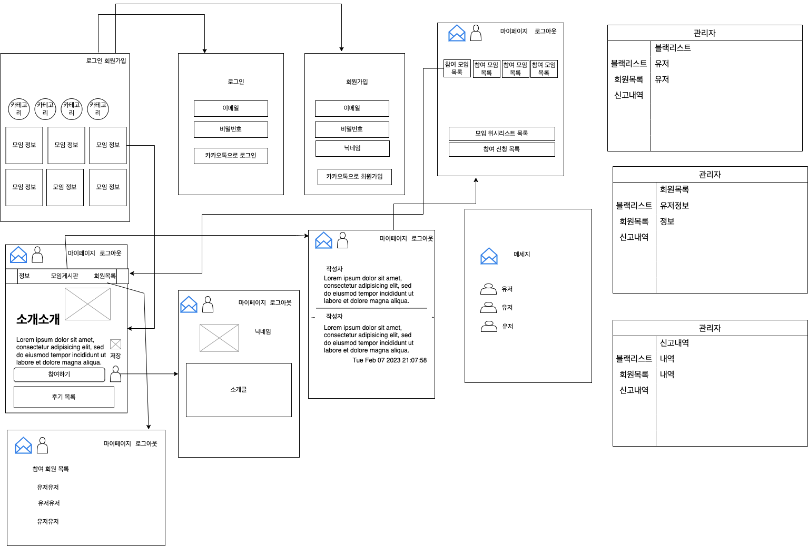
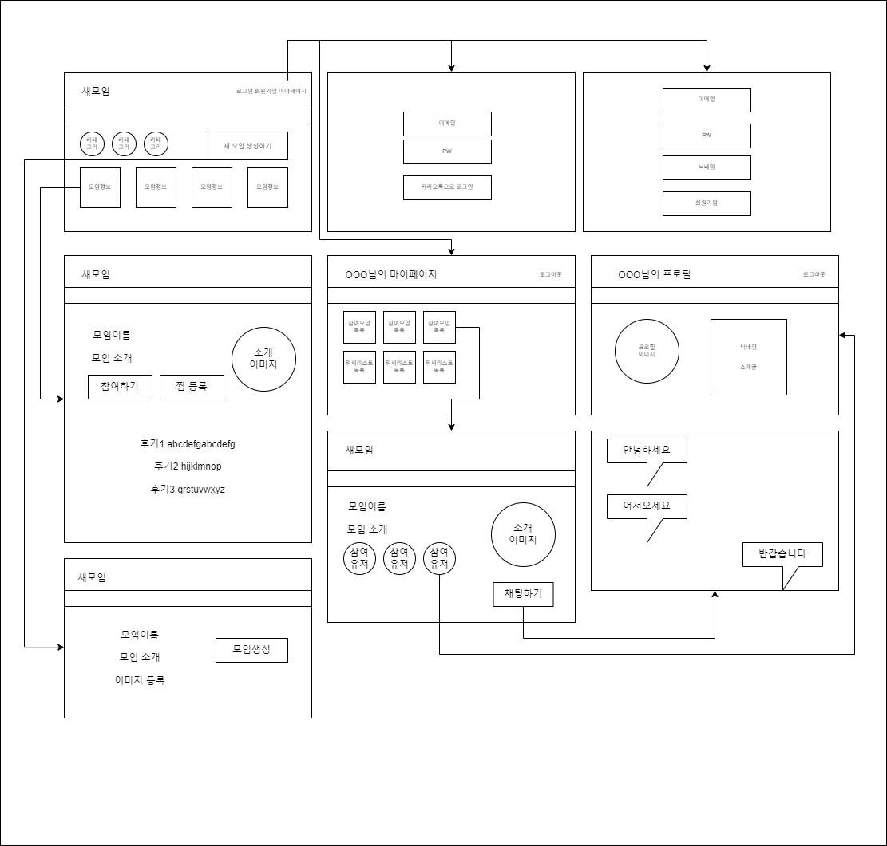
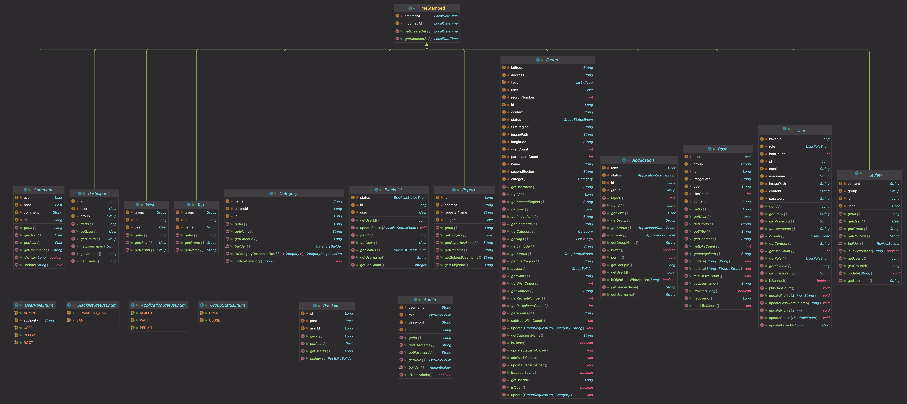
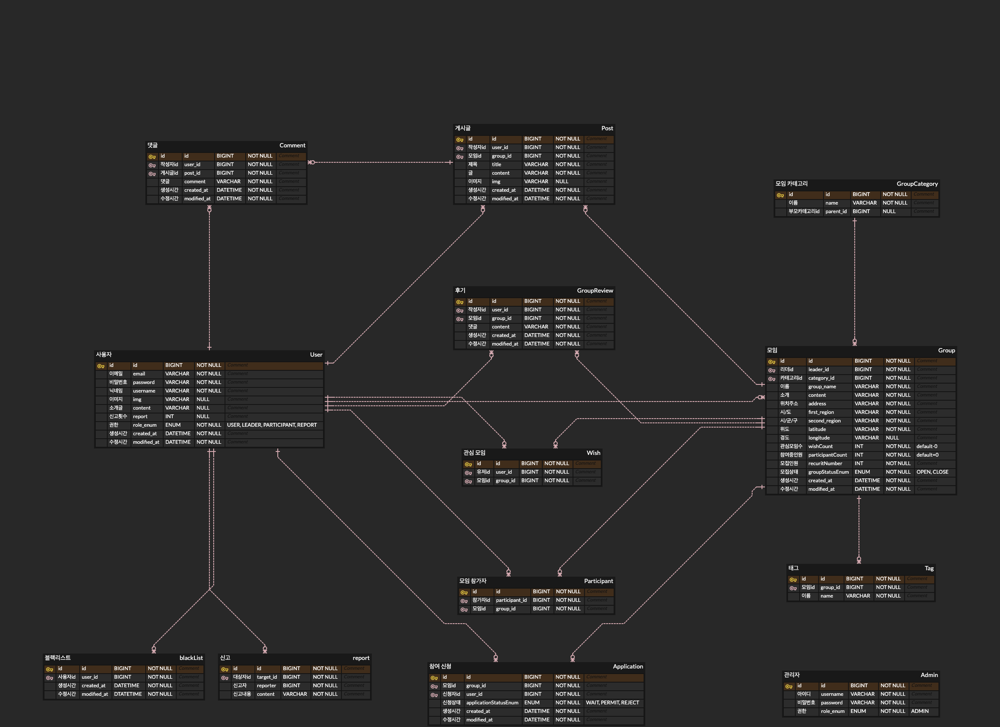

# 새모임 프로젝트🕊️
> 오프라인에서 취미활동을 함께 하거나, 혼자서는 갈 수 없는 곳에 함께 갈 파티원을 모집할 수 있는 서비스
___ 
### 프로젝트 설명  
새로운(New) 모임, 새(Bird)처럼 자유로운 모임  
무엇이든지 함께 할 사람들을 구할 수 있는 새모임 프로젝트.  
오프라인 파티원 모집 플랫폼으로 모임을 생성하고 참여할 수 있으며,  
각 모임의 참여자들은 게시판을 이용해 모임 구성원들과 소통할 수 있습니다.
___
### 기술 스택 

  

  
    
    
  
  
    
  

___

### 목차
<!-- TOC -->
* [새모임 프로젝트🕊️](#-)
    * [프로젝트 설명  ](#--br)
    * [기술 스택 ](#--br)
    * [프로젝트 개발 환경](#--)
    * [와이어 프레임](#-)
    * [서비스 아키텍처](#-)
    * [Class UML](#class-uml)
    * [ERD](#erd)
    * [팀소개](#)
<!-- TOC -->
___
### 프로젝트 개발 환경
- spring-boot 3.0.2
- JDK 17
- build.gradle

 의존 주입

<blockquote>
dependencies {

    implementation 'org.springframework.boot:spring-boot-starter-data-jpa'
    implementation 'org.springframework.boot:spring-boot-starter-web'
    implementation 'org.springframework.boot:spring-boot-starter-validation'
    implementation 'org.springframework.boot:spring-boot-starter-security'

    compileOnly 'org.projectlombok:lombok'
    annotationProcessor 'org.projectlombok:lombok'

    testImplementation 'org.springframework.boot:spring-boot-starter-test'
    testImplementation 'org.springframework.security:spring-security-test'

    testCompileOnly 'org.projectlombok:lombok'
    testAnnotationProcessor 'org.projectlombok:lombok'

    compileOnly group: 'io.jsonwebtoken', name: 'jjwt-api', version: '0.11.2'
    runtimeOnly group: 'io.jsonwebtoken', name: 'jjwt-impl', version: '0.11.2'
    runtimeOnly group: 'io.jsonwebtoken', name: 'jjwt-jackson', version: '0.11.2'

    implementation 'mysql:mysql-connector-java'
    implementation 'com.google.code.gson:gson:2.9.0'

    implementation 'org.springframework.boot:spring-boot-starter-data-redis'

    implementation 'org.springframework.boot:spring-boot-starter-mail'
    implementation 'org.springframework.boot:spring-boot-starter-oauth2-client:2.6.2'

    implementation group: 'com.amazonaws', name: 'aws-java-sdk-s3', version: '1.12.410'
    implementation group: 'org.springframework.cloud', name: 'spring-cloud-starter-aws', version: '2.2.1.RELEASE'

    developmentOnly 'org.springframework.boot:spring-boot-devtools'
}
</blockquote>

___
### 와이어 프레임

 wireFrame

___

### 서비스 아키텍처

 서비스 아키텍처

  

___

### Class UML

UML

### ERD

 ERD

___
### 팀소개

| 역할  | 이름  | 블로그                          |
|-----|-----|------------------------------|
| `리더`  | 이송언 | https://velog.io/@8essong30  |
| `부리더` | 장성준 | https://ace-jun.tistory.com  |
| `팀원`  | 이지섭 | https://velog.io/@leejiseop  |
| `팀원`  | 김현중 | https://pooca12.tistory.com  |